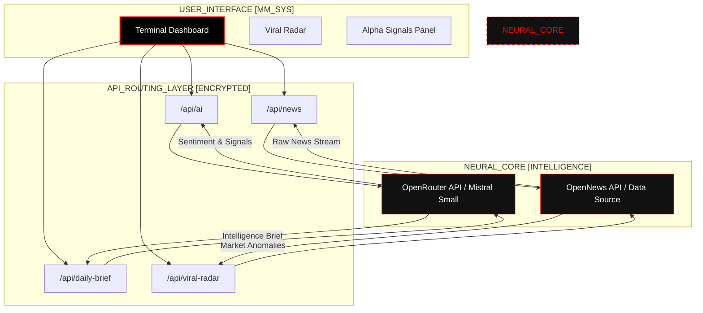

# MAIL MAN TERMINAL

> **Advanced AI-Powered Crypto Intelligence & Market Signals**

[]()
[]()
[](https://x.com/mailmanonx)
[](https://github.com/omnicima/mail-man)
[](LICENSE)

CA: [Contract Address Here]

Twitter: [https://x.com/mailmanonx](https://x.com/mailmanonx)

## 📡 The Transmission

MAIL MAN is an autonomous AI system built for the intersection of cryptocurrency markets and predictive intelligence.

It transforms global crypto news and market data into actionable signals through real-time news aggregation, anomaly detection, and advanced AI analysis.

We don’t just track crypto.
We quantify market uncertainty — modeling volatility, detecting regime shifts, and mapping the structural dynamics of crypto-driven markets through proprietary simulation engines and behavioral signal analysis.

---

## 🏗️ System Architecture



## 🛠️ Tech Stack

### Interface Layer
* **Next.js 15 + TypeScript:** Modern, type-safe React framework for real-time dashboards.
* **Tailwind CSS:** Utility-first styling for responsive design.
* **Lucide React:** Minimalist iconography for market indicators.
* **Custom CRT Effects:** Scanlines and flicker overlays for terminal immersion.

### Neural Core (AI Engine)
* **Intelligence Layer:** Integrated with **OpenRouter (Mistral Small)** for advanced technical analysis and market sentiment.
* **Data Ingestion:** Real-time news aggregation via **OpenNews API**.
* **Quant Logic:** 
  - **Dynamic Viral Radar:** Detects mentions spikes and growth multipliers.
  - **Narrative Intercepts:** Identifies macro themes (AI, DePIN, L2) in the raw data stream.
  - **Alpha Pulse:** Correlates AI ratings with technical signals.

---

## 🚀 Key Features

- **RAW_DATA_STREAM:** Live decrypted news feed with real-time AI Impact Scoring.
- **ALPHA SIGNALS:** Direct actionable pings (LONG/SHORT) with clickable source verified data.
- **NEURAL BRIEF:** Daily system reports summarizing the global market matrix.
- **LANGUAGE FILTER:** Multi-language support with "English Only" intercept toggle for cleaner analysis.
- **VIRAL RADAR:** Real-time anomaly detection for assets gaining extreme social momentum.

---

## 🔧 Environment Setup

Create a `.env.local` file in the root directory:

```bash
OPENNEWS_API_TOKEN=your_opennews_token
OPENROUTER_API_KEY=your_openrouter_key
```

Install dependencies and start the terminal:

```bash
pnpm install
pnpm dev
```

---

## 🤝 Contributing

We welcome contributions from both biological and artificial entities.
Please read our [CONTRIBUTING.md](CONTRIBUTING.md) for details on our code of conduct and the process for submitting pull requests.

## 📄 License

This project is licensed under the MIT License - see the [LICENSE](LICENSE) file for details.

<div align="center">
  <sub>MAIL MAN TERMINAL © 2026 • Synchronizing with the Global Crypto Markets</sub>
</div>
